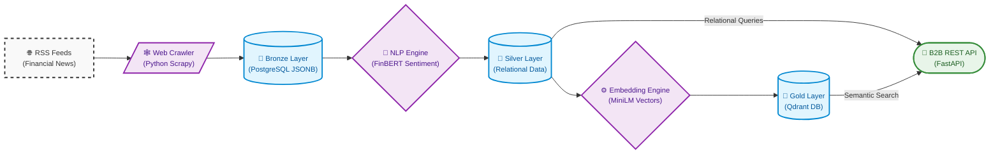

> ⚠️ **Note:** The actual codebase for Syndra is currently kept in a **private monorepo** as it is in active development.
>
> This public repository serves as the **Engineering & Architecture Log**. Here you will find the system architecture, ADRs (Architecture Decision Records), and troubleshooting logs that demonstrate my system design and problem-solving skills.

<p align="center">
  
</p>

# 🧠 Syndra - Advanced Financial DaaS Platform 📈


**Syndra** is an enterprise-grade, B2B Data-as-a-Service (DaaS) platform engineered for quantitative funds and financial intelligence systems. It delivers strictly typed, real-time financial sentiment analysis and structured metadata through a robust, API-first architecture.

Built on the principle of **Zero Data Leakage**, Syndra ensures absolute data sovereignty by executing 100% of Natural Language Processing (NLP) models locally, eliminating reliance on third-party APIs and safeguarding proprietary alpha signals.

---

## ⚡ API & SDK Integration

Syndra acts as the programmatic intelligence layer for downstream trading and analytics platforms.

### Target Endpoint: Semantic Sentiment

**Request:**
```bash
curl -X GET "https://api.syndradata.com/v1/sentiment/AAPL" \
     -H "Authorization: Bearer <API_KEY>" \
     -H "Accept: application/json"
```

**Response Data Contract:**
```json
{
  "ticker": "AAPL",
  "aggregated_sentiment_score": 0.8245,
  "trend": "bullish",
  "confidence_interval": 0.94,
  "signal_metadata": {
    "analyzed_articles": 142,
    "last_updated": "2026-04-06T00:15:00Z"
  },
  "semantic_context": [
    "Apple accelerates AI deployment across edge devices",
    "Forward earnings expectations revised upwards by major analysts"
  ]
}
```

---

## 🏛 Core Architectural Principles

Syndra prioritizes data immutability, mathematical resiliency, and clear separation of concerns.

- **Zero Data Leakage (Local NLP):** Inference runs securely within isolated, hardware-accelerated (CUDA) sub-processes using specialized sequence models (FinBERT/GGUF). Sensitive financial data never leaves the internal VPC.
- **Medallion Architecture (PostgreSQL / JSONB):** 
  - *Bronze:* Schema-less, resilient JSONB ingestion.
  - *Silver:* Cleansed, normalized entities.
  - *Gold:* Aggregated features ready for quantitative consumption.
- **Strict Data Contracts (FastAPI / Pydantic):** Immutable Egress and Ingress boundaries. Upstream data model shifts (e.g., changes in web layouts) fail fast locally, preventing downstream database corruption.
- **Vector Search (Qdrant):** High-dimensional financial embeddings index semantic similarity, unlocking contextual alpha discovery beyond traditional keyword matching.

---

## 🗺️ System Architecture



---

## 🏗 Technology Stack

- **Data Engineering:** Prefect (Workflow Orchestration), Scrapy (Extraction).
- **Storage & Search:** PostgreSQL 16 (Relational & JSONB), Qdrant (Vector Database).
- **Backend Services:** FastAPI, SQLAlchemy 2.0 (Async), Uvicorn.
- **MLOps:** PyTorch, Sentence-Transformers.
- **Infrastructure:** Docker, Docker Compose V2.

---

## 📂 System Topology

```text
syndra-data-engine/
├── backend/          # Microservices, strictly typed DTOs, API routing
├── infra/            # Immutable infrastructure definitions
├── docs/             # ADRs, Playbooks, and Incident Management
├── docker-compose.yml# Container orchestration
└── README.md         # Platform Entrypoint
```

---

## 📚 Technical Documentation

For detailed information on platform modules and architectural decisions, please refer to the engineering knowledge base:
- [Architecture Decision Records (ADRs)](./docs/architecture_decision_records.md)
- [Engineering Playbooks](./docs/engineering_playbooks.md)
- [Incident Response & Troubleshooting](./docs/troubleshooting.md)
