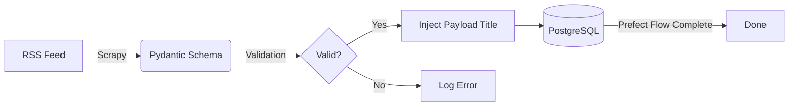

> ⚠️ **Note:** The actual codebase for Syndra is currently kept in a **private monorepo** as it is in active development.
>
> This public repository serves as the **Engineering & Architecture Log**. Here you will find the system architecture, ADRs (Architecture Decision Records), and troubleshooting logs that demonstrate my system design and problem-solving skills.

# 🧠 Syndra 📰


> **Intelligent News Aggregator leveraging Edge AI, Hybrid Search, and robust Data Engineering.**

Syndra is designed to combat **"infoxication"** through semantic understanding of news articles and user-aligned personalized feeds. Built with a strict **Docker-First**, **Microservices-oriented Monorepo** architecture.

---

## ✨ Core Features

- **Automated Data Pipelines:** Fault-tolerant News RSS scraping via Prefect.
- **Strict Data Contracts:** Pydantic validation ensuring only clean data enters the system.
- **Idempotent Ingestion:** Safe retry mechanisms preventing duplicate database entries via URL hashing.
- **Semantic Search:** Find articles by meaning via Vector Embeddings, not just exact keyword matches.
- **Local AI Processing:** 100% private, on-device Machine Learning inference.

---

## 🏗 System Architecture

The project follows a modular, high-performance pipeline:

1.  **Data Engineering (ETL):** `Scrapy` + `Prefect` extracting and validating data into a raw Postgres layer.
2.  **MLOps (Batch Inference):** Local LLMs (`llama.cpp` + `GGUF`) summarizing and generating embeddings (`sentence-transformers`).
3.  **High-Performance Backend:** Async `FastAPI` serving Hybrid Search (BM25 + Vector) via `Qdrant` & `PostgreSQL`.
4.  **RecSys:** User-vector profiling based on reading history context.

### The Ingestion Pipeline


---

## 📂 Monorepo Structure

```text
neural-news/
├── backend/          # FastAPI application, Pydantic models, ML inference routers
├── frontend/         # MVP UI (Streamlit / React)
├── infra/            # Nginx, Prometheus/Grafana configs (Future)
├── docs/             # Extended architecture documents (C4 models)
├── docker-compose.yml# Main Docker infrastructure configuration
├── .env.example      # Global environment variables template
└── README.md         # This file
```

---

## 🚀 Quickstart (Docker-First)

The entire stack is containerized. **You MUST have Docker and Docker Compose V2 installed** on your host machine. No local Python environments or database installations are required.

### 1. Clone the repository
```bash
git clone https://github.com/FranSMM/neural-news.git
cd neural-news
```

### 2. Setup environment variables
Configure your local environment by copying the example file:
```bash
cp .env.example .env
```

### 3. Spin up the infrastructure
Run the stack in detached mode:
```bash
docker compose up -d
```

### 4. Run the ETL Pipeline
Extract, validate, and load news articles into your PostgreSQL database asynchronously:
```bash
make run-etl
```

---

## 📚 Documentation
For more detailed information on specific modules, refer to their respective READMEs:
- [Backend Documentation](./backend/README.md)
- [Frontend Documentation](./frontend/README.md)
- [Infrastructure Documentation](./infra/README.md)
- [Architecture Decision Records](./docs/arquitecture_decision_records.md)
- [Troubleshooting & Incidents](./docs/troubleshooting.md)
